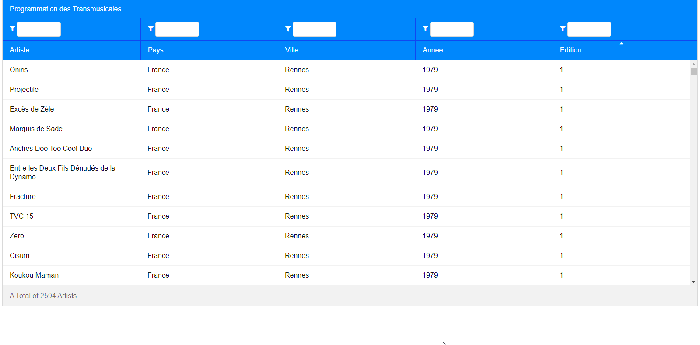

# MVVM ZK Transmusicales

Programming a java web app with Zk framework.

Features :

- Reads artists & festival data from .json.
- Display results in an interactive table
- Can sort and filter entries.

Exercise for University.


## Preview
### Results


### Filtered Results

 
## Useful Build Commands

run jetty (using gretty)
```
./gradlew appRun
```
run tomcat (using gretty)
```
./gradlew tomcatRun
```
run jetty (with jetty-runner - faster startup)
```
./gradlew startJettyRunner
```
http://localhost:8080/zk-gradle

run tests
```
./gradlew test
```

build war
```
./gradlew war
```