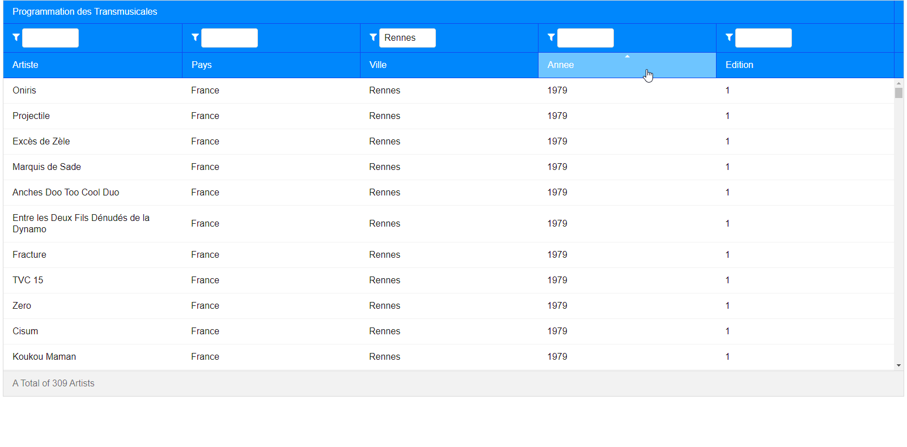

# Programmation des Transmusicales

## Results


## Filtered Results



### _Old ReadMe_ (Ignore the following)

# ZK Gradle

Example ZK project using gradle

## Useful Build Commands

run jetty (using gretty)
```
./gradlew appRun
```
run tomcat (using gretty)
```
./gradlew tomcatRun
```
run jetty (with jetty-runner - faster startup)
```
./gradlew startJettyRunner
```
http://localhost:8080/zk-gradle

run tests
```
./gradlew test
```

build war
```
./gradlew war
```

## License
* Demo Code - [Apache License 2.0](http://www.apache.org/licenses/LICENSE-2.0)
