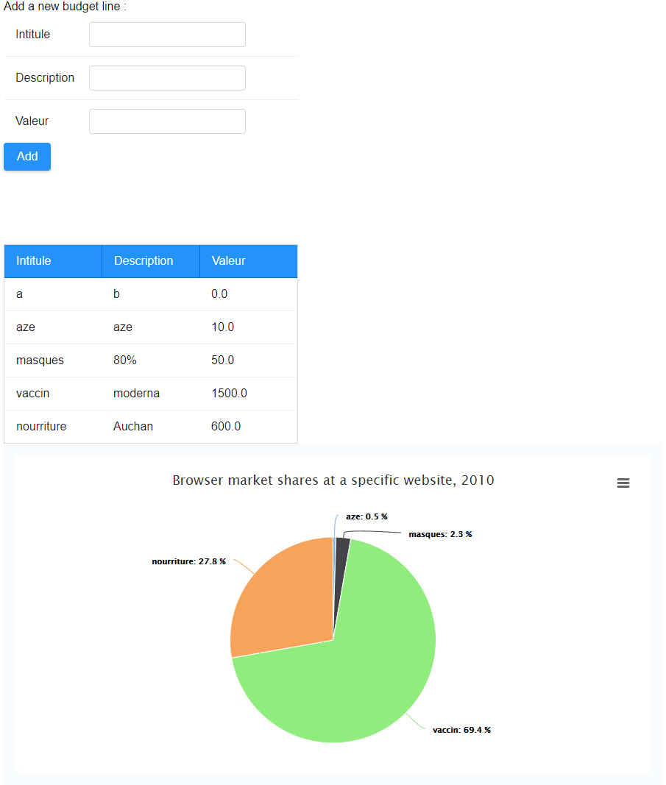

# Zk Demo App

Demo app in Java with Zk framework.  
MVVM implementation with Form, Table & graph element.

Exercise for University.

## Preview




## Useful Build Commands

run jetty (using gretty)
```
./gradlew appRun
```
run tomcat (using gretty)
```
./gradlew tomcatRun
```
run jetty (with jetty-runner - faster startup)
```
./gradlew startJettyRunner
```
http://localhost:8080/zk-gradle

run tests
```
./gradlew test
```

build war
```
./gradlew war
```
